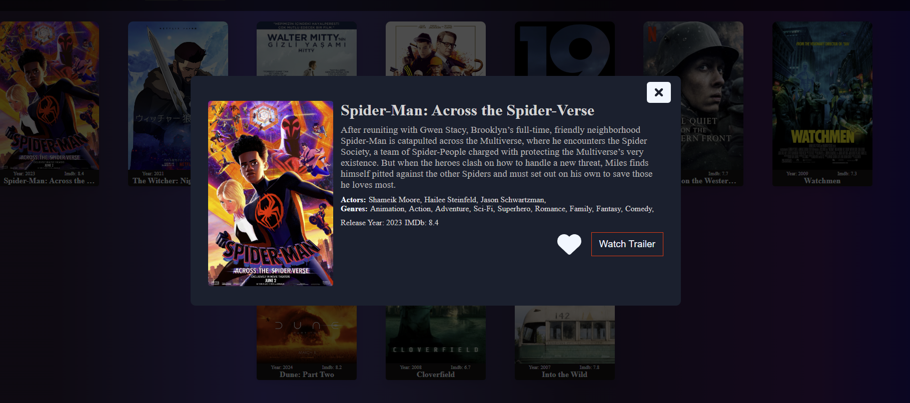
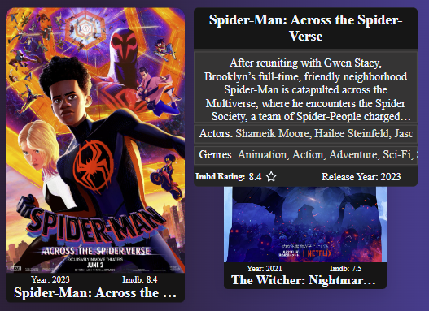
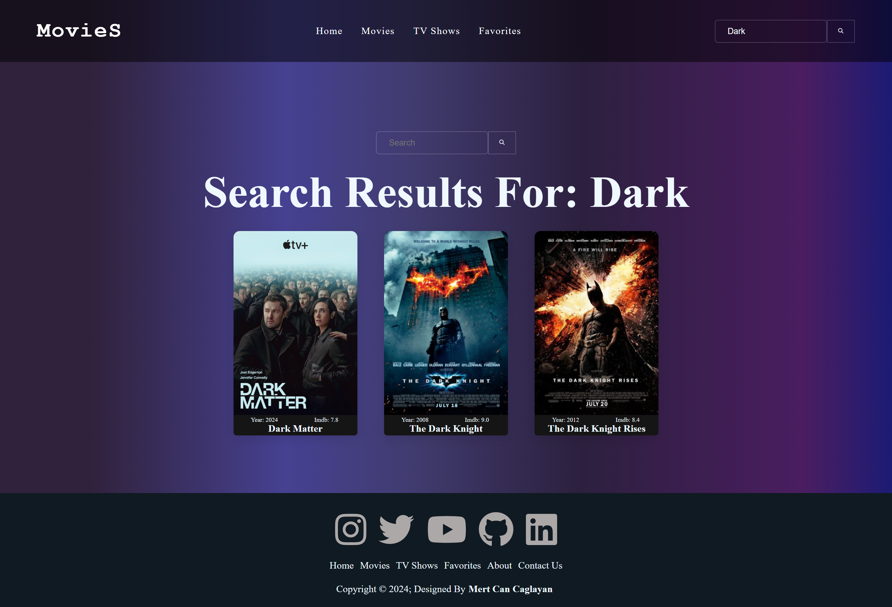
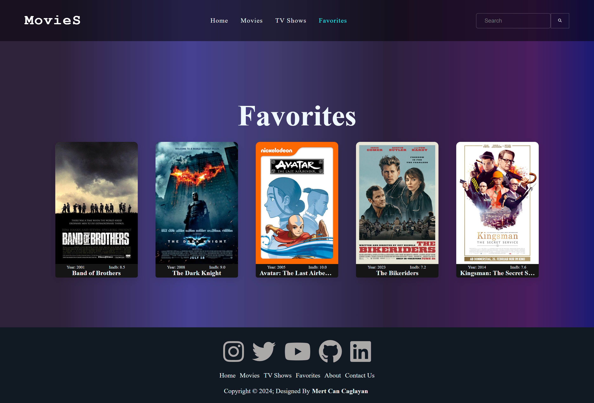

# Movie Website App

Welcome to the Movie Website App! This project is built with React and allows users to explore and discover movies and TV series. Below are the main features and functionalities of the app.

## Features

-   **Search**: Users can search for movies and TV series by title.
-   **Home Page**:
    -   **Banner**: Displays a sliding banner with popular movies.
        -   **Navigation Buttons**: Allows users to navigate through the banner items.
        -   **Banner Item List**: Shows a list of popular movies with their title, description, genres, ratings, and release year.
        -   **Banner Title**: Displays the title "Trending Now" with icons.
    -   **Gallery**: Displays various categories of movies and TV series.
        -   **Popular Gallery**: Shows a list of popular movies and TV series.
        -   **Recommended Gallery**: Shows a list of recommended movies and TV series.
        -   **Top 20 Gallery**: Shows a list of top 20 movies and TV series.
        -   **Popup on Card Click**: Opens a popup with detailed information about the selected movie or TV series.
            -   **Watch Trailer Button**: Opens a new tab to the movie's YouTube trailer.
            -   **Image and Details**: Displays an image and detailed information about the movie or TV series.
            -   **Favorite Button**: Heart-shaped button to save the movie or TV series to your favorites.
-   **Movie Page**: Dedicated page to browse movies.
-   **TV Series Page**: Dedicated page to browse TV series.
-   **Tooltip on Card Hover**: Displays additional information when hovering over any movie or TV series card.
-   **Favorites Page**: View all saved favorite movies and TV series.
-   **Genre Filter**: Filter movies and TV series by genre on the respective pages.

## Getting Started

Follow these instructions to get a copy of the project up and running on your local machine for development and testing purposes.

### Prerequisites

Make sure you have the following installed:

-   Node.js
-   npm (Node Package Manager)

## Previews

### Home Page


### Movie/TV Series Page


### Popup



### Tooltip



### Search Page



### Favorites Page



## Usage

You can visit the website and try out its features [here](https://moviereactwebsite.netlify.app).

### Home Page

-   **Banner**:
    -   Navigate through popular movies using the navigation buttons.
    -   Each banner item displays the movie's title, description, genres, ratings, and release year.
-   **Gallery**:
    -   Browse through the Popular, Recommended, and Top 20 galleries.
    -   Click on a movie or TV series card to open a popup with detailed information.
    -   Use the "Watch Trailer" button in the popup to view the movie's trailer on YouTube.
    -   Click the heart-shaped favorite button to save the movie or TV series to your favorites.

### Search

Use the search bar at the top of the page to find movies or TV series by title. Results will be displayed as you type.

### Movie Page

Browse through the collection of movies. Use the genre buttons to filter the movies based on genres.

### TV Series Page

Browse through the collection of TV series. Use the genre buttons to filter the TV series based on genres.

### Card Hover Tooltip

Hover over any movie or TV series card to see a tooltip with additional information.

### Favorites Page

Access the favorites page to view all the movies and TV series you have saved.

### Installation

1. Clone the repository:

    ```bash
    git clone https://github.com/your-username/movie-website-app.git
    ```

2. Navigate to the project directory:

    ```bash
    cd movie-website-app
    ```

3. Install the dependencies:

    ```bash
    npm install
    ```
